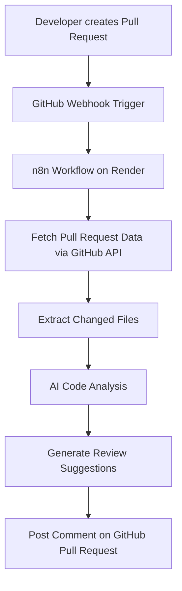

# AI GitHub Code Reviewer Agent

Automated AI-powered workflow that analyzes GitHub pull requests and posts intelligent review comments.

This project uses event-driven automation to monitor pull requests and perform automated code analysis.

---

## Overview

Developers often spend time reviewing pull requests manually.  
This project automates the initial code review process.

When a pull request is created or updated:

1. GitHub sends a webhook event.
2. n8n workflow triggers automatically.
3. Pull request data is fetched using GitHub API.
4. Code changes are analyzed.
5. AI generates review suggestions.
6. Suggestions are posted as comments on the pull request.

---

## System Architecture



---

```bash

GitHub Pull Request
       ↓
GitHub Webhook
       ↓
n8n Workflow (Render Cloud)
       ↓
Fetch Pull Request Metadata
       ↓
Analyze Code Changes
       ↓
Generate Review Suggestions
       ↓
Comment on Pull Request

```

---

## Tech Stack

 n8n – workflow automation engine

GitHub API – pull request events and data

Render – cloud deployment platform

Webhooks – event-driven triggers

AI Model – automated code analysis

Features

 • Automated pull request monitoring

 • Event-driven workflow using GitHub webhooks

 • Automatic extraction of pull request changes

 • AI-based code review suggestions

 • Fully automated comment posting on pull requests

 • Cloud deployment using Render

---

## Deployment

The workflow is deployed on Render and runs continuously.

Example deployment URL:
```
[https://ai-pr-code-reviewer.onrender.com](https://ai-pr-code-reviewer.onrender.com)
```
The automation workflow runs using scheduled triggers and webhook events.

---

## Example Workflow

 1. Developer opens a pull request.

 2. GitHub sends a webhook event.

 3. n8n workflow starts automatically.

 4. Pull request changes are analyzed.

 5. AI generates review suggestions.

 6. Review comments appear directly on the pull request.

---

## Repository Structure
```

```
